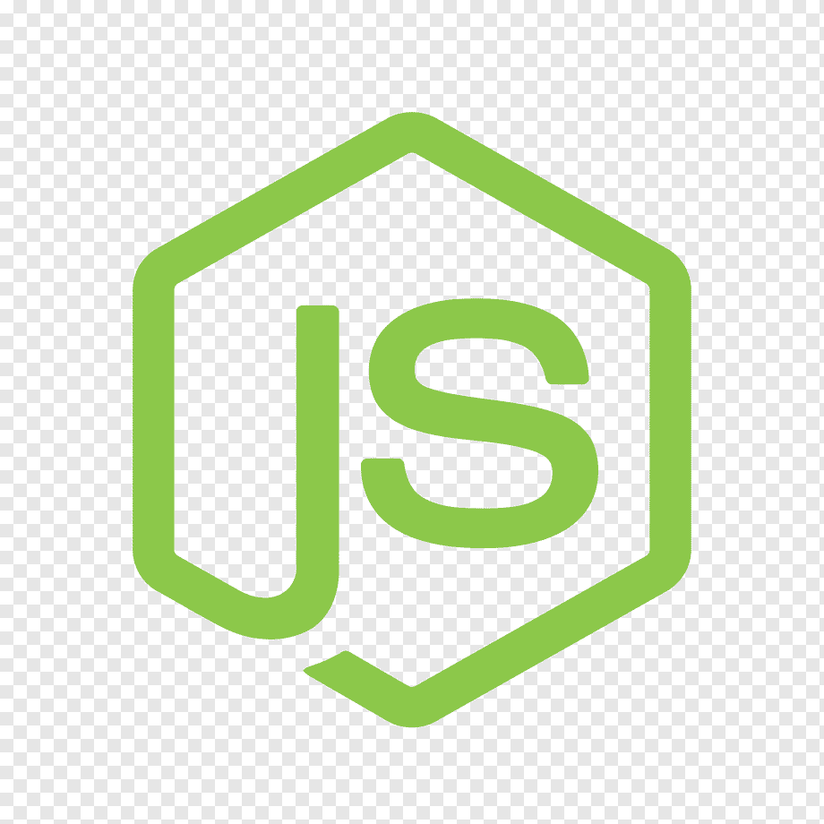

<a name="top"></a>

#Backend Rental Movie
---


:speech_balloon: [About](#id1)   

:hammer: [Tools](#id2)

:clipboard: [Instructions](#id3)

:eye_speech_bubble: [Creating the Backend](#id4)

:mailbox: [Postman](#id5)

:smile: [Thanks](#id6)

---

<a name="id1"></a>
## **About**

Realization of the back-end for a future movie rental application.

Currently, the search for movies and series is being carried out connecting with the free API of the Movie Database.

This project is part of the [GeeksHubs Academy](https://bootcamp.geekshubsacademy.com/) Full Stack Developer Bootcamp. 

---
**Start date:** 19 / May /2021

**Deadline:** 23 / May /2021

**Contributors:**
* [Carlos Quintero Moreno](https://github.com/CarlosRQuinteroM)
* [Mariana Fernández Sacristán](https://github.com/mlfernandez)

---

<a name="id2"></a>

## **Tools**

Creating this project we work with these tools and technologies.

|  | Visual Code Estudio |

|  | JavaScript | 

|  | NODE JS & EXPRESS |

|  | AXIOS | 

|  | Git |

|  | GitHub | 

|  | The Movie Database API | 

|  | Postman | 


<a name="id3"></a>
***
## **Instructions**

1. <h3> Starting Node Package Manager </h3>
   (We must have installed Node.js)
Using npm init from the command line initializes the project’s package.json file.

```javascript
npm init -y
```
2. <h3>Install the Axios dependency</h3>
Axios is a popular, promise-based HTTP client that sports an easy-to-use API and can be used in both the browser and Node.js.

```javascript
npm i axios --save
```
3. <h3> Add {"start":"node index.js"} in the file package.json section "scripts"</h3>
```json
  "scripts": {
   "start": "node index.js", 
    "test": "echo \"Error: no test specified\" && exit 1"
  },
```

4. <h3>Install framework Express </h3>
Express is a minimal and flexible Node.js web application framework that provides a robust set of features to develop web and mobile applications. It facilitates the fast development with Node based Web applications.

```javascript
npm install express --save
```

5. <h3> Delete the ^ simbol in "dependencies" file  package.json </h3>
```json
"dependencies": {
    "axios": "^0.21.1",
    "express": "^4.17.1"
  },
```

6. <h3> Add index.js on the Work space folder</h3>

7. <h3> Add .gitignore on the Work space folder and inside write</h3>
```json
/node_modules
```
8. <h3>Now we are ready to work on the backend!</h3>
>To know more about this See Creating the Backend below.

9. <h3>To conect to the server write on the terminal</h3>
```javascript
npm start
```
10. <h3>Now we can see the Data in Postman.</h3>
>To know more about this see Postman below.

<a name="id4"></a>
## Creating the Backend

1. <h3>index.js</h3>
*  We have to call Node Express
```javascript
const express = require('express');
```
* Save and execute.
```javascript
const app = express();
```
* Also declare the port where we are going to upload the server.
```javascript
const port = 3000; 
```
* Save the constant router and match it to the require method and tell it that we import it from router.js.
```javascript
const router = require('./router'); 
```
* Express provides you with middleware to deal with the (incoming) data (object) in the body of the request.

 * Express.json() is a method inbuilt in express to recognize the incoming Request Object as a JSON Object. This method is called as a middleware in your application using the code.

```javascript
app.use(express.json()); 
```
* We build middleware for all application paths with.
```javascript
app.use(router);  
```
* Lift and initialize the server.
```javascript
app.listen(port, () => console.log(`Node server running on http://localhost:${port}`));
```


2. <h3>router.js</h3>

* We have to call Node Express.
```javascript
const router = require('express').Router();
```
* Call the files on the folder routes.
```javascript
const moviesRouter = require('./routes/moviesRouter');
const seriesRouter = require("./routes/seriesRouter");
```
* This says that when the user puts the path where it should go.
```javascript
router.use("/movies", movieRouter);
router.use("/series", seriesRouter);
```

* Finally export the file routers.
```javascript
module.exports = router;
```


3. <h3>utiles.js</h3>

In this file we create the functions that we need to export in other folders.
In this case, the (checkId) function transforms the users' words into gender identifiers through a for / if loop, which allows the identification numbers to be searched in the Database to be translated.

We added a case-sensitivity so that no matter how it's written, it can be found anyway.
Finally we export this file, so that we can use it in other files.

```javascript
 const checkId = (nombre) => {
  let traductorGenero = [
    {
      id: 28,
      name: "action",
    ...
    {
      id: 37,
      name: "western",
    },
    
  ];
  
  for (let i = 0; i < traductorGenero.length; i++) {
    if (traductorGenero[i].name === nombre) {
      return traductorGenero[i].id
    }
  }
};
 
module.exports = checkId;
```


4. <h3>controllers</h3>

Controllers contain callback functions which we pass to the router's methods. 

We will need one for each, Movies and Series.

First  call Axios, this is a popular, promise-based HTTP client that sports an easy-to-use API and can be used in both the browser and Node.js.

And the function  export in utiles.

```javascript
const axios = require("axios");
const checkId = require("../utiles");
```
Then we create the callbacks funtions with the endopoint to the The Movie Database.
This is an example in class Peliculas, a function to search the Top Rated Movies.

```javascript

class Peliculas {
  async findTopRated() {
    let res = await axios.get(
      "https://api.themoviedb.org/3/movie/top_rated?api_key=210d6a5dd3f16419ce349c9f1b200d6d&language=en-US&page=1"
    );

    return res.data;
  }

let moviesController = new Peliculas();
module.exports = moviesController;

```


5. <h3>routes</h3>

A route is a section of Express code that associates an HTTP verb (GET, POST, PUT, DELETE, etc.), a URL path/pattern, and a function that is called to handle that pattern.

```javascript
const router = require("express").Router();
const moviesController = require("../controllers/moviesController");
```
We have one for each Series and Movies, this is a example of one of this to search Top Rated Movies.

```javascript
router.get("/", async (req, res) => {
  try {
    res.json(await moviesController.findTopRated());
  } catch (err) {
    return res.status(500).json({
      mensaje: err.mensaje,
    });
  }
});

module.exports = router;
```

<a name="id5"></a>
***
## **Postman**

>Postman is a collaboration platform for API development. Postman's features simplify each step of building an API and streamline collaboration so you can create better APIs—faster.


[](https://app.getpostman.com/run-collection/0bb02cfc04d105dd4329?action=collection%2Fimport)


<a name="id6"></a>
***
## **Thanks**

We would like to thank our teacher, David, for his help and dedication. And to our bootcamp partners for every help and suggestion received.

<br>
<br>

[UP](#top)